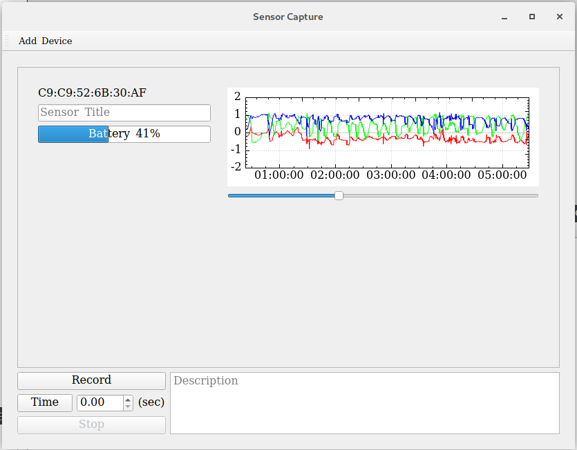

# S.M.A.R.T



## Introduction

[](https://ci.appveyor.com/project/pollend/smart) [](https://opensource.org/licenses/Apache-2.0)

S.M.A.R.T is a utility application used for collecting and saving data from MbientLab's [MetaMotionSensor](https://mbientlab.com/product/metamotionc/). This tool at the moment only supports these sensors, but there are some potential plans to support other devices. 

This project is fully open sources and licensed under Apache 2.0.

## Development

This project was developed with Qt Creator. [here](https://www.qt.io/download)

Just follow the instructions for installation and open the projects from the `SensorCapture.pro` file.


## Maintainers

The current maintainers of this repository are:

* Michael Pollind <polli104@mail.chapman.edu>


# License

```
/**
* Copyright 2018 GaitRehabilitation
*
* Licensed under the Apache License, Version 2.0 (the "License");
* you may not use this file except in compliance with the License.
* You may obtain a copy of the License at
*
*     http://www.apache.org/licenses/LICENSE-2.0
*
* Unless required by applicable law or agreed to in writing, software
* distributed under the License is distributed on an "AS IS" BASIS,
* WITHOUT WARRANTIES OR CONDITIONS OF ANY KIND, either express or implied.
* See the License for the specific language governing permissions and
* limitations under the License.
*/

```